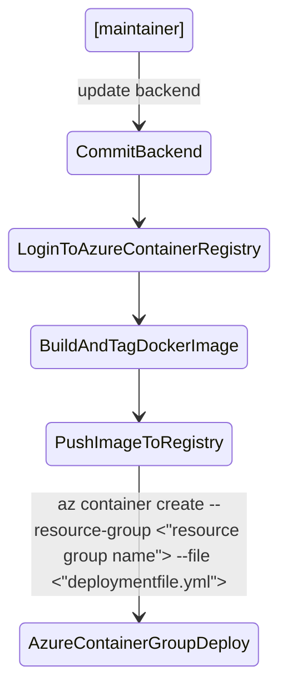
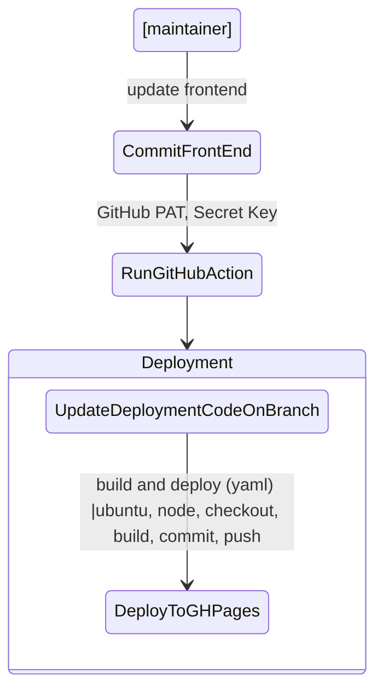
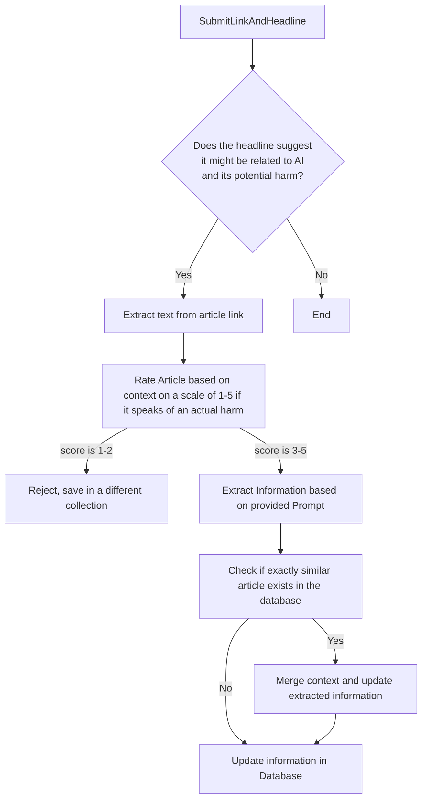

# AIFU

 **AI flub ups**
 
AIFU is a one stop solution for researchers and anyone looking for a place to learn about the repercussions of using AI blatently, too soon, indiscriminately, harmfully.

**How to contribute?**

Steps -
1. Go to the country of the concerned article/news.
2. Enter the article, organization and other details you could discern (you see an example when you go to the country)
3. Press `Submit`

## Outline
The objective of this project is to establish a comprehensive archive or repository that serves as a centralized resource for policymakers, researchers, students, and other stakeholders seeking to acquire knowledge regarding the potential adverse consequences arising from the indiscriminate, premature, or injudicious use of algorithms and AI.

Through this platform, my aim is to monitor the utilization of AI by governmental entities. By conducting thorough analysis of the collected data, I want to find out if we can provide "concrete course(s) of action" or policy recommendations to lawmakers, the general public, and other stakeholders regarding their engagement with AI-based services. Crucially, this initiative will enable us to gain insights into the preferences and purposes of government agencies in employing AI. By doing so, we can proactively address potential risks associated with AI based implementation in specific domains such as child welfare and recidivism, while promoting fair and equitable utilization of AI.

**Motivation**
Necessity: Knowing about something harmful is crucial for several reasons -
* By identifying the underlying factors that led to the harmful event, steps can be taken to prevent similar incidents from occurring in the future.
* important for developing a deeper understanding of the risks and downsides associated with a particular technology, process, or behavior. Armed with this knowledge, we can take proactive steps to mitigate risks and prevent harm, improving the safety and wellbeing of ourselves and those around us.
* knowledge of the harmful consequences of AI can help to drive the development of better, more responsible AI technology. By understanding the ways in which AI can be harmful, researchers and developers can work to address these issues and build AI systems that are safer, more transparent, and more trustworthy.
* It is imperative for policymakers and the general public to be aware of the potential harmful consequences of using AI for several reasons.Policymakers have a responsibility to regulate the use of AI technology to ensure that it is safe, ethical, and serves the public interest. In order to do this effectively, they need to have a comprehensive understanding of the risks and downsides associated with AI.
* The general public needs to be informed about the potential harmful impacts of AI so that they can make informed decisions about how they interact with the technology. By being aware of the potential risks, individuals can take steps to protect their privacy, security, and well-being when using AI-powered tools and services.

What makes this project **intresting** is that I plan to archive, extract and collate relevant information from the articles using AI itself. Therefore this platform and project is an exercise in -
- collaborating with AI to examine the misuses and harm from the tool in a meta-analysis
- working together to explore its possible negative impacts in a self-reflective manner.
- leveraging AI to gain insights into the potential risks and downsides of AI technology
- using AI to inform our understanding of the possible negative impacts and consequences associated with AI

In short LLM or AI is the judge, jury, and executioner if you will.

**Related literature**

Most of the existing databases and projects around this are more about general (deeper) understanding of AI, accountability, fairness and transparency where real life examples are just case studies. They are very broad in their general reach which I believe dilutes their effectiveness. Some of the important resources that I found in  my literature review research are -

[The AI Index](https://aiindex.stanford.edu/) by The Stanford Institute for Human-Centered Artificial Intelligence

They do not gather information about the harms caused by AI but about the developments, growth, measuring trends and progress and market of AI in various countries. They also track global AI legislation. Quoting them -
> The AI Index Report tracks, collates, distills, and visualizes data related to artificial intelligence. Its mission is to provide unbiased, rigorously vetted, and globally sourced data for policymakers, researchers, executives, journalists, and the general public to develop intuitions about the complex field of AI.

Reports are available from the year 2017 with a gap in 2020.

[The AI Now Institute](https://ainowinstitute.org/)

They focus on accountability and on policy recommendations. Their aim is not to create any database of harms. However studying their reports and recommendations would be instrumental for the last step of this project which is policy recommendations. Quoting them -
> Founded in 2017, the AI Now Institute produces diagnosis and policy research to address the concentration of power in the tech industry. We develop policy strategy to redirect away from the current trajectory: unbridled commercial surveillance, consolidation of power in very few companies, and a lack of public accountability.

[Data Harm Record](https://datajusticelab.org/data-harm-record/) by Data Justice Lab

This is not a database but a running document that has not been updated since August 2020. The definition of harm is closer to the kind of cases that I wish to have in my database but the cases they have studied range from generic harm to specific harms. Since its not being maintained anymore, my plan is to use all the articles that it references and to input it to the system I have designed. The idea is that all those cases should be integrated and to observe why a particular case was rejected.

[AI Incident Database](https://incidentdatabase.ai/)

This is the closest database to what I am building. Quoting them -
> The AI Incident Database is dedicated to indexing the collective history of harms or near harms realized in the real world by the deployment of artificial intelligence systems. Like similar databases in aviation and computer security, the AI Incident Database aims to learn from experience so we can prevent or mitigate bad outcomes.

They however collect a rather broad spectrum of cases - incidents where intelligent systems have caused safety, fairness, or other real-world problems. 
It has also changed a lot since the time I started working. A while ago you could only browse and read the content of submitted incident's article(s). Since then they have added a multitude of features such as Named Entities, CSET Taxonomy Classifications, GMF Taxonomy Classifications, a timeline of reports and a list of similar reports/variants. However not all incidents have all this information associated with them and its not apparently clear on what basis are incients chosen to be worked upon to provide all the relevant information.

To the best of my knowledge, nothing like what we are trying to do has been done before.

**Data**

**How does the corpus help you answer your research question?**
Citing possible solutions based on implementations in other countries, latest developments in AI that successfully mitigate the shortcomings of previous scenarios/models, guardrails placed by other countries and regulations in other countries.
With all the information and analysis, I want to find out if in the end we can “Recommend” some “concrete” course of action(s) or policy decisions to lawmakers, general public and other stakeholders.

**Approach**

Once a user submits any article by providing its URI and Headline, we first try to figure out if the article is not at all related to what we are looking for by analyzing the headline itself. The idea here is to reject irrelevant articles and not so much accept relevant articles becasue that happens in the next step.

OpenAI provides a content moderation api but we dont use moderation api to filter misuse of content because the idea is not to reject content that may be talking about difficult topics. We do however check for prompt injection (when a user attempts to manipulate the AI system by providing input that tries to override or bypass the intended instructions or constraints set by us/developer). 

After that, we extract the contents of the article using the provided URI. Following which, using prompt engineering, we try to extract all the relevant content by asking questions. And finally we also summarize the article. The outputs are then serialized to be stored in the database.

Before actually storing the contents in the database, we also query the database for exactly similar articles (maybe the same article was already stored before or maybe a different media reported on the same case, both of which are highly likely). If an exactly similar article is found then we try to merge the information extracted now with whatever we had extracted earlier and update the database record. If the article and case is completely new then we just make a new record in the database. 

API Endpoints
* `/records` : GET Request - Responsible for providing the details of cases per country to the frontend.
* `/submit` : POST Request - Responsible for creating Automatic GitHub issues/discussions whenever a user submits an article.
* `/heartbeat` : GET Request - Used for testing if the server is alive.
* `/export` : GET Request - Provides a json file of exported content from the database collection for a given country.
* `/extract_information` : POST Request - The main information extraction endpoint that triggers all the steps listed in **Approach**.

More endpoints may be added later on based on the needs of the project.

**Result**

**Conclusion**

**Definition of Success**
* Data: plateaus over time
* Views: Increase and then decrease and plateau 
* Information about removing bias, increasing fairness would become commonplace and part of the development lifecycle itself. 
* Ethicists would be part of the team

**Technical Details**

Git/GitHub Branches
* [gatsby](https://github.com/armsp/AIFU) - the main branch for UI. This is where the development code for the frontend resides.
* [gh-pages](https://github.com/armsp/AIFU/tree/gh-pages) - built automatically by the GitHub Action that is triggered by a push to gatsby. This branch holds the deployment code for the Frontend.
* [backend](https://github.com/armsp/AIFU/tree/backend) - this branch contains the code for the backend server that runs on Azure. It also has jupyter notebooks with experiments on NLP tasks. It is important to note that the backend code is redacted and not all files are present since some files contain private credentials for deploying to Azure or otherwise. 

BACKEND SERVER

FRONTEND UI

Information Extraction

## Features to come

- [ ] automatic extraction of Affected Group
- [ ] Automtic extraction of Perpeterator
- [ ] Analysis of text (NLP) to extract the **cause** and the **effect**, short summary
- [ ]  Graph representations of relations
- [ ] take snapshots of articles using github actions becasue articles may expire or move
- [ ] Extracting more technical information from the links as you said in the meeting – we either do this using ChatGPT “API calls” or make our own Q&A model for:
  * Who developed the model/AI system?
  * How and where was it deployed?
  * What ORG/group of people used it and how?
  * Other technical details
  * Its subsequent effects… 
  * Did the state/party accept their error?
  * Were there compensations made? Apologies?
  * Did they address the issue in a more tangible way through any legislation/bills and (or) regulation?
  * Where there any regulations/bills & legislation already in place that still failed to prevent this?
  * Did something similar happen again? Why?
  * Are there any legislations in the pipeline?
  * Were there any legislations that got blocked? Why? What were the arguements? Who blocked it?
- [ ] Provide an API or ability to download the whole dataset we are curating so that others could it for other purposes.
- [ ] Filepond? securedrop?
- [ ] ^ use Azure Blob Storage and Azure Functions to upload small image, PDF, txt files. Exclude executables.
- [ ] Switch to a vector database? Perhaps its not necessary right now since we don't have a lot of data.

## Technical Workflow

1. From the website people submit the form

2. The website makes a POST request to a server that validates the input data so as to make sure that only valid data is pushed to the DB, and to avoid attacks, script executions etc.

3. The server then pushes the data to the DB - perhaps after also a second human validation (can do it via Telegram bot)

4. The updated DB table is reflected on the website after a few hours.

## Development Activities
- [ ] Link https://aifu.shantam.io/about to README.md
- [ ] Form Submission: add optional entries for [GitHub, Twitter, Other(scholarly sites)] usernames
- [x] CSS for countries
- [x] Fix Home page for number of articles
- [x] Finish footer
- [ ] Grey/Disable countries for which there is no information
- [ ] Make an automatic Last Updated <date> tag like the WIP one we have
- [ ] Whats the best way to show more detailed information about the issue?
- [ ] How can users request for snapshots if the article link is down?
- [ ] Caching of DB reuests for countries as well as the whole dataset
- [ ] Testimonial Page : If you found this useful or if it helped you in your work or if you used the informaiton here to do somehting then I would love to hear from you.

## Change Log
 * Frontend Tech Stack - React, gatsby, vega-lite, MUIv5 
 * Cases are shown as tables where rows can be expanded. This is the current approach until we face performance issues.
 * Setup a MongoDB database on Azure
 * Letting gpt do everything: search the internet, summarize, answer, extract information (Langchain), we don't want to link to paywalled articles???, figure out what goes in the db and what does not on its own

## Decision Log
Using AI for meta-analysis. Using AI for everything!
The whole platform has AI generated data and information.
You input a link. Agent decides if the link is relevant or not. If it is relevant then it extracts information (answers to questions above) from the text. Can ask for more info or gather more info from other articles about the same issue. Can identify an article that talks about the same issue and update information instead of adding new information about the issue. The idea is not to provide an exact text from the articles but "generated text" (asking LM to make a "report", because we don't want to provide links to paywalled websites). The agent itself updates the database and hooks trigger a website rebuild.

**Clock** - 55 hrs
